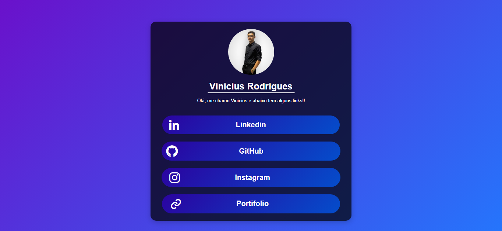

# Meu Site de Links

## Descrição

Bem-vindo ao **Meu Site**! Este projeto é uma página de perfil que centraliza todos os seus links importantes em um só lugar, inspirado na funcionalidade do Linktree. É um site simples, porém eficiente, onde você pode compartilhar seus links para diversas plataformas, facilitando o acesso para seus amigos, seguidores ou clientes.

## Demonstração

Você pode acessar o site através do seguinte link: [Meu Site](https://dev-viniciusrodrigues.vercel.app/)

## Funcionalidades

- Interface limpa e moderna
- Integração com diversas plataformas de mídia social
- Facilidade de uso e navegação
- Animações sutis para uma experiência de usuário aprimorada

## Tecnologias Utilizadas

- HTML5
- CSS3
- [Boxicons](https://boxicons.com/) - Ícones utilizados nos links
- [Vercel](https://vercel.com/) - Hospedagem do projeto

## INTERFACE



## Instalação

Para executar este projeto localmente, siga os passos abaixo:

1. Clone o repositório:
   ```bash
   git clone https://github.com/Mvini7/cards-de-links
